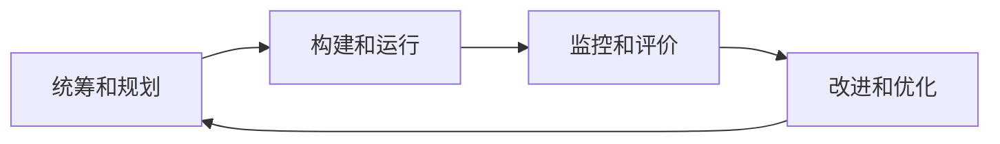

# 数据治理

[TOC]

 

## 数据治理的问题

### 数据质量

+ 黑暗数据问题
+ 数据尾气问题
+ 其他数据可信性问题
  + 不一致
  + 不完整
  + 不准确
  + 不正确
  + 不及时

### 数据整合

+ 数据孤岛问题

### 业务流程整合

+ 数据定义和统计口径不一致问题

### ~~数据安全风险~~

+ 数据收集和提取的合法性
+ 数据隐私的保护

 

## 数据治理框架

### ~~顶层设计~~

+ 战略规划
+ 组织构建
+ 架构设计

### ~~数据治理环境~~

+ 内外部环境
+ 促进因素

### 数据治理域

+ 数据管理体系
  + 数据标准
  + 数据质量
  + 数据安全
  + 元数据管理
  + 数据生命周期管理

+ 数据价值体系
  + 数据流通
  + 数据服务
  + 数据洞察

### 数据治理过程

 

<!--

## 数据治理体系

### ~~战略~~

+ 数据战略
+ 组织机制
+ 数据文化

### ~~管理~~

+ 理现状与定目标
  + 现状评估
    + ~~数据思维和认知现状~~
    + IT系统现状
    + 数据分布现状
    + 数据管理现状
    + 数据质量现状
+ 能力成熟度评估
+ 路线图规划
  + 确定数据治理优先级
  + 绘制数据治理路线图
+ 保障体系建设
+ 技术体系建设
+ 策略执行与监控
+ 绩效考核
+ 长效运营

-->

### 技术

+ 数据梳理与建模
  + __数据建模__
+ 元数据管理
  + __数据血缘分析__
+ 数据标准管理
+ 主数据管理
  + 主数据梳理与识别
  + 主数据分类与编码
  + 主数据清洗
  + 主数据集成
+ 数据质量管理
  + 数据的生命周期
    + 计划
    + 获取
    + 存储
    + 共享
    + 维护
    + 应用
    + 消亡
  + 管理活动
    + 识别
    + 测量
    + 监控
    + 预警  
+ ~~数据安全治理~~
+ 数据集成与共享
  + 数据集成架构良好
  + 数据集成模式清晰
  + 数据集成策略明确

### 工具

+ 数据模型管理工具
  + 功能
    + 可视化建模
      + ~~支持企业级数据模型的构建~~
      + ~~支持系统级数据模型开发~~
      + 支持数据模型的反向采集
        + 数据字典
      + 支持数据模型导入
        + PowerDesigner
        + erwin
        + ER/Studio  
    + 模型版本管理
    + 数据模型管理
    + 数据模型查询
    + 数据模型浏览
    + 数据模型
+ 元数据管理工具
  + 系统架构
    + 应用层
      + 全景数据资产地图
        + 血缘分析
        + 影响分析
        + 冷热度分析
        + 关联度分析
    + 管理层
    + 采集层
      + 数据源元数据
      + ETL元数据
      + ODS元数据
      + ETL元数据
      + DW元数据
    + 数据源层
      + 业务系统
      + ETL
      + ODS
      + DW
  + 功能
    + 元数据采集服务
    + 应用开发支持服务
    + 元数据访问服务
    + 元数据管理服务
    + 元数据分析服务
  + 开源实现工具
    + __Apache Atlas__
+ 数据标准管理工具
  + 元数据的标准化
  + 主数据和参考数据标准
  + 指标数据标准
+ 主数据管理工具
  + 系统架构
    + 业务系统层
      + 主数据单一数据源
    + 主数据集成层
      + 主数据的清洗
      + 主数据的转换
      + 主数据的装载
      + 主数据的映射
      + 主数据的分发
    + 主数据管理层
      + 主数据建模
      + 主数据管理
      + 主数据质量
      + 主数据安全
    + 主数据应用层  
+ 数据质量管理工具
  + 常见工具
    + 数据解析和标准化工具
    + 数据清理工具
    + 数据分析工具
    + 数据质量监控工具
    + 数据集成工具
  + 开源实现工具
    + __Apache Falcon__
+ ~~数据安全治理工具~~
+ 数据集成与共享工具
  + 数据资源层
    + 交换库
    + 共享库
      + 基础数据
      + 主题数据
      + 专题数据
    + 目录库

 

> 参考文献

+ __中华人民共和国国家标准：信息技术服务 治理 第5部分：数据治理规范__
  （GB/T 34960.5—2018）

+ __DAMA数据管理知识体系指南__

+ __一本书讲透数据治理：战略、方法、工具与实践__
  用友平台与数据智能团队

+ __大数据治理__
  桑尼尔·索雷斯

+ __大数据治理与安全：从理论到开源实践__
  刘驰 胡柏青 谢一
