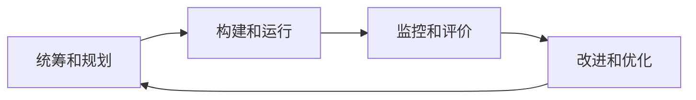

# 数据治理

[TOC]

 

## 认识数据治理

+ 数据治理
  + 数据治理是对**数据资产**管理行使权力和控制的活动集合
    国际数据管理协会（DAMA）

+ 数据资产
  + 全景数据资产地图

 

### 常见的相关概念

+ 数据元
  + 用一组**属性**描述定义、标识、表示和允许值的数据单元
    国标[GB/T 18391.1—2002]
    + 例如个人信息中，性别为数据元，“男”和“女”为数据元的值
+ 元数据
  + 描述数据的数据或关于数据的结构化数据
    + 一本书的封面和目录向我们展示了这样的元数据信息：图书名称、作者姓名、出版商和版权细节、图书的提纲、标题、页码等
+ 主数据
  + 基准数据
  + 企业内需要在多个部门、多个信息系统之间共享的数据
    + 如客户、供应商、组织、人员、项目、物料等
+ 业务数据
  + 交易数据
  + 业务活动过程或系统自动产生的既定事实的数据
+ 主题数据
  + 为了进行面向主题的分析或加速主题应用的数据
  + 分析型数据
    + 可以由多个主数据和交易数据组成
    + 一般是汇总的、不可更新的、用于读的数据

+ 数据仓库
  + 面向主题的、集成的、相对稳定的、反映历史变化的数据集合
  + 数据库的一种概念上的升级
+ 数据湖
  + 以原始格式存储数据的存储库或系统
    维基百科

 

## 数据治理的问题

### 数据质量

+ 黑暗数据问题
  + 被收集和处理但又不用于任何用途的数据
+ 数据尾气问题
  + 针对单一目标而收集的数据，通常用过之后就被归档闲置
+ 其他数据可信性问题
  + 不一致
  + 不完整
  + 不准确
  + 不正确
  + 不及时

 

### 数据整合

+ 数据孤岛问题
  + 企业发展到一定阶段时，各个部门各自存储数据，部门之间的数据无法共通

 

### 业务流程整合

+ 数据定义和统计口径不一致问题
  + “巴别塔”
    + 圣经·创世记：希望能通往天堂的高塔

 

### ~~数据安全风险~~

+ 数据收集和提取的合法性
+ 数据隐私的保护

 

## 数据治理框架

### ~~顶层设计~~

+ 战略规划
+ 组织构建
+ 架构设计

 

### ~~数据治理环境~~

+ 内外部环境
+ 促进因素

 

### 数据治理域

+ 数据管理体系
  + 数据标准
  + 数据质量
  + 数据安全
  + 元数据管理
  + 数据生命周期管理

+ 数据价值体系
  + 数据流通
  + 数据服务
  + 数据洞察

 

### 数据治理过程

 

## 数据治理体系

### ~~战略~~

+ 数据战略
+ 组织机制
+ 数据文化

 

### 管理

+ 理现状与定目标
  + 现状评估
    + ~~数据思维和认知现状~~
    + IT系统现状
      + 系统架构
        + 列出每个IT系统的技术架构，如开发语言、数据库、C/S或B/S，单体架构、SOA架构或微服务架构，依赖的中间件等
      + 系统集成
        + 列出每个系统的接口现状，包括是否存在外部接口、有哪些接口、有哪些接口方式等，并说明系统集成的问题，如数据库点对点集成、接口数据丢失等
      + 系统使用
        + 列出每个系统的使用单位、部门、主要用户，并说明系统使用过程中经常存在的问题
      + 系统数据
        + 列出每个系统包含的关键数据，并说明这些关键数据在使用和管理过程中存在的核心问题，例如数据孤岛问题、数据质量问题、数据安全问题等
    + 数据分布现状
      + 绘制数据资源分布图
        + 数据域划分
          + 可以根据企业的业务域划分数据域
        + 数据资源归类
          + 根据信息化及业务部门调研结果，将梳理出的数据资源归类到对应的数据域中，形成数据资源分布图
    + 数据管理现状
      + 数据定义是否清晰
      + 数据模型是否完整
      + 数据是否在多个系统共享
      + 确权认责是否明确
      + 数据标准是否健全
      + 数据管理的流程是否已建立
      + 数据管理的制度是否已建立
      + 数据质量是否满足
      + 数据是否实现了集成或共享
      + 数据安全是否受控
    + 数据质量现状
      + 缺乏统一的数据标准
      + 缺乏规范的数据标准定义流程
      + 企业对数据质量不够重视
      + 缺乏有效的管理工具
      + 业务系统数据普遍存在数据不完整、不准确、不真实、不及时，以及数据关系混乱等问题
+ 能力成熟度评估
+ 路线图规划
  + 确定数据治理优先级
  + 绘制数据治理路线图
+ 保障体系建设
+ 技术体系建设
+ 策略执行与监控
+ 绩效考核
+ 长效运营

 

### 技术

+ 数据梳理与建模
  + **数据建模**
+ 元数据管理
  + **数据血缘分析**
+ 数据标准管理
+ 主数据管理
  + 主数据梳理与识别
  + 主数据分类与编码
  + 主数据清洗
  + 主数据集成
+ 数据质量管理
  + 数据的生命周期
    + 计划
    + 获取
    + 存储
    + 共享
    + 维护
    + 应用
    + 消亡
  + 管理活动
    + 识别
    + 测量
    + 监控
    + 预警
+ ~~数据安全治理~~
+ 数据集成与共享
  + 数据集成架构良好
  + 数据集成模式清晰
  + 数据集成策略明确

 

### 工具

+ 数据模型管理工具
  + 功能
    + 可视化建模
      + ~~支持企业级数据模型的构建~~
      + ~~支持系统级数据模型开发~~
      + 支持数据模型的反向采集
        + 数据字典
      + 支持数据模型导入
        + PowerDesigner
        + erwin
        + ER/Studio  
    + 模型版本管理
    + 数据模型管理
    + 数据模型查询
    + 数据模型浏览
    + 数据模型
+ 元数据管理工具
  + 系统架构
    + 应用层
      + **全景数据资产地图**
        + 血缘分析
        + 影响分析
        + 冷热度分析
        + 关联度分析
    + 管理层
    + 采集层
      + 数据源元数据
      + ETL元数据
      + ODS元数据
      + ETL元数据
      + DW元数据
    + 数据源层
      + 业务系统
      + ETL
      + ODS
      + DW
  + 功能
    + 元数据采集服务
    + 应用开发支持服务
    + 元数据访问服务
    + 元数据管理服务
    + 元数据分析服务
  + 开源实现工具
    + **Apache Atlas**
+ 数据标准管理工具
  + 元数据的标准化
  + 主数据和参考数据标准
  + 指标数据标准
+ 主数据管理工具
  + 系统架构
    + 业务系统层
      + 主数据单一数据源
    + 主数据集成层
      + 主数据的清洗
      + 主数据的转换
      + 主数据的装载
      + 主数据的映射
      + 主数据的分发
    + 主数据管理层
      + 主数据建模
      + 主数据管理
      + 主数据质量
      + 主数据安全
    + 主数据应用层  
+ 数据质量管理工具
  + 常见工具
    + 数据解析和标准化工具
    + 数据清理工具
    + 数据分析工具
    + 数据质量监控工具
    + 数据集成工具
  + 开源实现工具
    + **Apache Falcon**
+ ~~数据安全治理工具~~
+ 数据集成与共享工具
  + 数据资源层
    + 交换库
    + 共享库
      + 基础数据
      + 主题数据
      + 专题数据
    + 目录库

 

> 参考文献

+ **中华人民共和国国家标准：信息技术服务 治理 第5部分：数据治理规范**
  （GB/T 34960.5—2018）

+ **DAMA数据管理知识体系指南**

+ **一本书讲透数据治理：战略、方法、工具与实践**
  用友平台与数据智能团队

+ **大数据治理**
  桑尼尔·索雷斯

+ **大数据治理与安全：从理论到开源实践**
  刘驰 胡柏青 谢一
